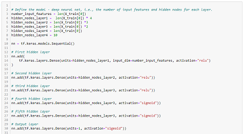

# Neural_Network_Charity_Analysis

****
****

## USING NEURAL NETWORKS TO HELP CREATE A BIANARY CLASSIFIER THAT IS CAPABLE OF PREDICTING IF APPLICANTS WILL BE SUCCESSFUL.
  
****
****

Using neural networks, use the features in the dataset to help Beks create a binary classifier that is capable of predicting whether applicants will be successful if funded by Alphabet Soup.

Using Pandas and the Scikit-Learn’s StandardScaler(), preprocess the dataset in order to train, and evaluate the neural network. We will bin diverse features, drop unnecessary columns, encode categorical variables, and finally scale the data.

Using knowledge of TensorFlow, deep learning model, to create a binary classification model that can predict if an organization will be successful based on the features in the dataset. Then compile, train, and evaluate our classification model to calculate the model’s loss and accuracy.

Using knowledge of TensorFlow, optimize model to try and achieve a target predictive accuracy higher than 75%.

## Results

* Data Preprocessing
  * What variable(s) are considered the target(s) for your model?
    - The target for my model are is the "IS_SUCCESSFUL" column. 
  * What variable(s) are considered to be the features for your model?
     - All of the included features except "EIN" and "NAME" were included at first then 'STATUS','SPECIAL_CONSIDERATIONS', and 'INCOME_AMT' were dropped in attempts to optimize the model.
  * What variable(s) are neither targets nor features, and should be removed from the input data?
    - "EIN" and "NAME" are neither.
* Compiling, Training, and Evaluating the Model
  * How many neurons, layers, and activation functions did you select for your neural network model, and why?
    - trial and error, because we are not taught any other strategies. 
     
  * Were you able to achieve the target model performance?
    -  no
  * What steps did you take to try and increase model performance?
    - adjusted the amount of hidden layers, the amount of nodes in each layer, activation fuctions for each layer.

## Summary

The results were underwhelming. I couldn't get above 70.4% accuracy. Something that might help in the future would being taught other methods to optimize, something other than trial and error. A different model might have worked better also.